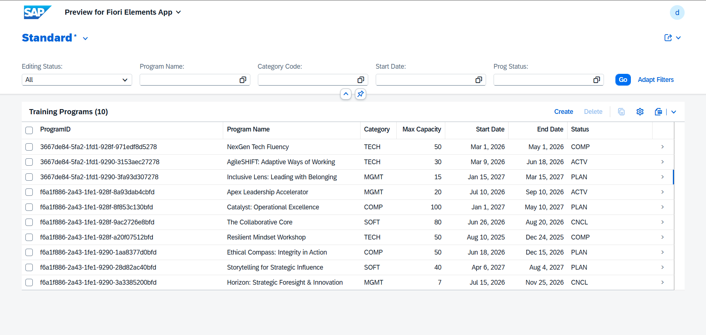
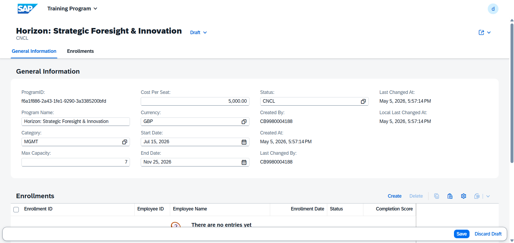
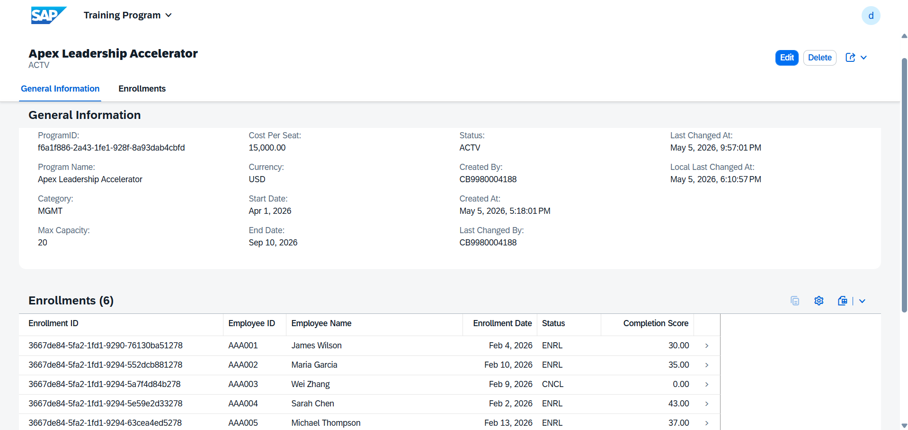
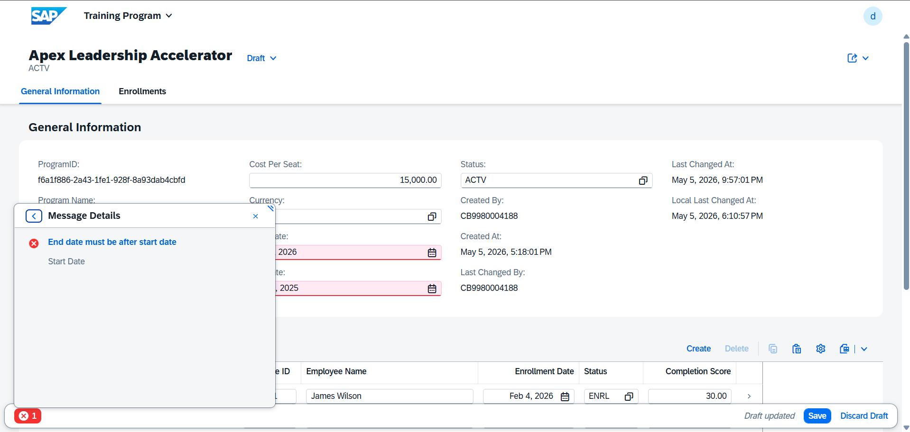
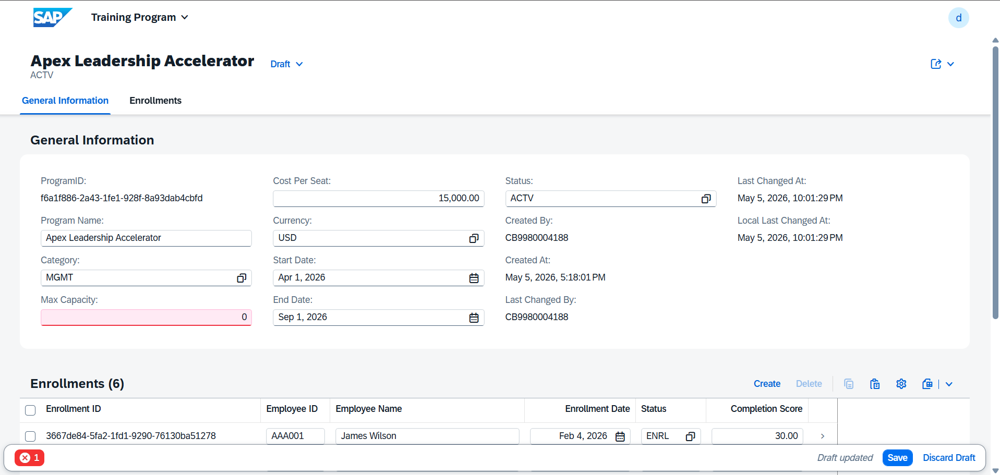
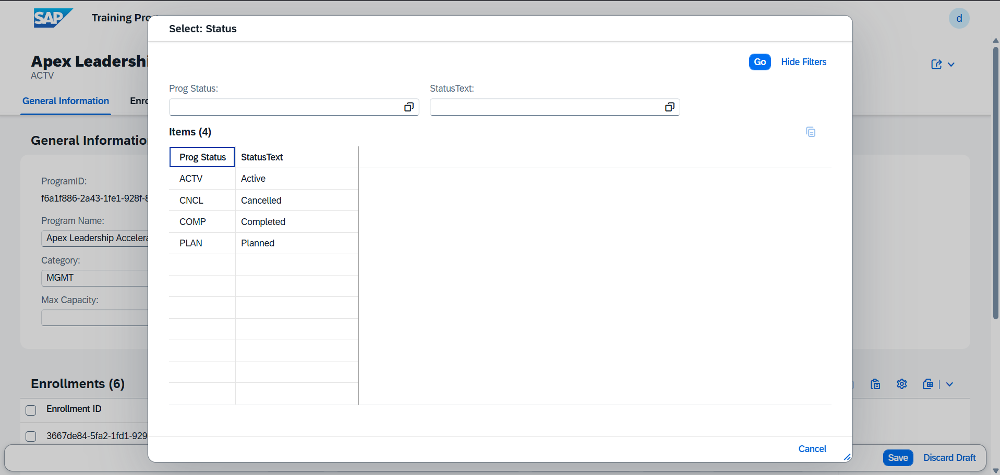
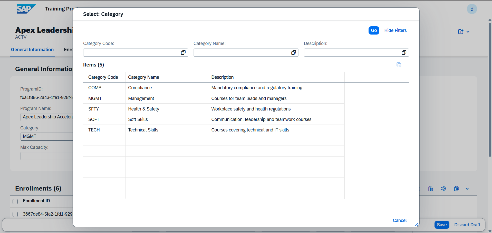
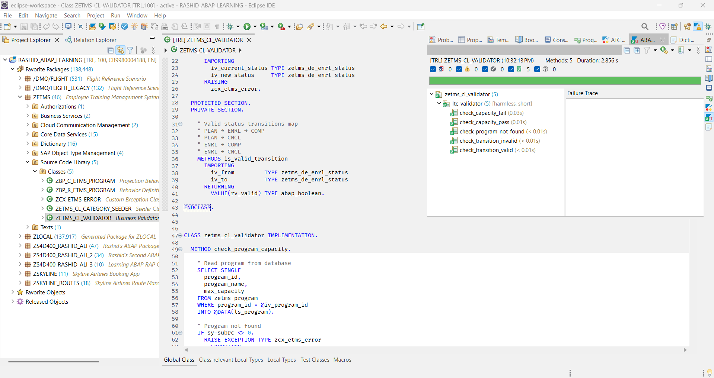

# 🎓 Employee Training Management System (ETMS)
### SAP ABAP Cloud · RESTful Application Programming Model (RAP) · OData V4 · Fiori Elements

---

<!-- SCREENSHOT: Take a full-page screenshot of your Fiori List Report showing the Training Programs list with a few records. Save as: docs/screenshots/01_program_list.png -->


---

## 📋 Table of Contents

- [Project Overview](#project-overview)
- [Business Scenario](#business-scenario)
- [Architecture](#architecture)
- [Database Schema](#database-schema)
- [Technical Stack](#technical-stack)
- [Key Features](#key-features)
- [Project Structure](#project-structure)
- [Core Concepts Demonstrated](#core-concepts-demonstrated)
- [Business Rules & Validations](#business-rules--validations)
- [Testing](#testing)
- [Screenshots](#screenshots)
- [Setup & Deployment](#setup--deployment)
- [Author](#author)

---

## 📖 Project Overview

The **Employee Training Management System (ETMS)** is a full-stack enterprise application built on **SAP Business Technology Platform (BTP)** using **ABAP Cloud** and the **RESTful Application Programming Model (RAP)**. It demonstrates production-quality SAP backend development including managed Business Objects, draft-enabled OData V4 services, server-side business logic, custom exception handling, and automated unit testing.

This project was built as part of preparation for the **SAP Certified Backend Developer — ABAP Cloud** certification and represents real-world enterprise development patterns used in SAP S/4HANA Cloud implementations.

---

## 🏢 Business Scenario

A company needs to manage its internal employee training programs. HR managers need to:

- Create and manage **Training Programs** with capacity limits, costs, and categories
- **Enroll employees** into programs and track their progress
- Enforce **business rules** — no duplicate enrollments, capacity limits, date validations
- Track enrollment **status workflows** — Planned → Enrolled → Completed / Cancelled
- View everything through a clean **Fiori Elements UI** with dropdown value helps

---

## 🏗️ Architecture

The application follows SAP's standard **two-layer CDS architecture** with full RAP managed scenario:

```
┌─────────────────────────────────────────────────────────┐
│                    Fiori Elements UI                     │
│              (OData V4 — List Report + Object Page)      │
└─────────────────────────┬───────────────────────────────┘
                          │ OData V4
┌─────────────────────────▼───────────────────────────────┐
│                  Service Layer                           │
│         ZUI_ETMS_PROGRAM_O4 (Service Binding)           │
│         ZUI_ETMS_PROGRAM_O4 (Service Definition)        │
└─────────────────────────┬───────────────────────────────┘
                          │
┌─────────────────────────▼───────────────────────────────┐
│              Projection Layer (ZC_*)                     │
│   ZC_ETMS_PROGRAM          ZC_ETMS_ENROLLMENT           │
│   (Root Projection View)   (Child Projection View)       │
│   ZC_ETMS_PROGRAM (BDEF)   Metadata Extensions          │
└─────────────────────────┬───────────────────────────────┘
                          │
┌─────────────────────────▼───────────────────────────────┐
│              Interface Layer (ZR_*)                      │
│   ZR_ETMS_PROGRAM          ZR_ETMS_ENROLLMENT           │
│   (Root Interface View)    (Child Interface View)        │
│   ZR_ETMS_PROGRAM (BDEF)   ZBP_R_ETMS_PROGRAM (Class)  │
└─────────────────────────┬───────────────────────────────┘
                          │
┌─────────────────────────▼───────────────────────────────┐
│               Database Layer                             │
│   ZETMS_PROGRAM    ZETMS_ENROLLMENT    ZETMS_CATEGORY   │
│   ZETMS_PROGRAM_D  ZETMS_ENRLLMNT_D   (Draft Tables)   │
└─────────────────────────────────────────────────────────┘
```

### RAP Business Object Composition Tree

```
ZR_ETMS_PROGRAM (Root — lock master)
│
└── ZR_ETMS_ENROLLMENT (Child — lock dependent)
```

---

## 🗄️ Database Schema

### Entity Relationship Diagram

```
┌──────────────────────┐         ┌─────────────────────────────┐
│   ZETMS_CATEGORY     │         │      ZETMS_PROGRAM           │
│  (Reference Data)    │         │   (Parent — Transactional)   │
│──────────────────────│         │─────────────────────────────│
│ PK category_code     │◄────────│ FK category_code            │
│    category_name     │         │ PK program_id (UUID x16)    │
│    description       │         │    program_name             │
└──────────────────────┘         │    max_capacity             │
                                 │    cost_per_seat            │
                                 │    currency_code            │
                                 │    start_date               │
                                 │    end_date                 │
                                 │    status                   │
                                 │    [admin fields]           │
                                 └──────────────┬──────────────┘
                                                │ 1
                                                │ composition
                                                │ N
                                 ┌──────────────▼──────────────┐
                                 │     ZETMS_ENROLLMENT         │
                                 │   (Child — Transactional)    │
                                 │─────────────────────────────│
                                 │ PK enrollment_id (UUID x16) │
                                 │ FK program_id               │
                                 │    employee_id              │
                                 │    employee_name            │
                                 │    enrollment_date          │
                                 │    status                   │
                                 │    completion_score         │
                                 │    [admin fields]           │
                                 └─────────────────────────────┘
```

### Table Details

| Table | Type | Purpose |
|-------|------|---------|
| `ZETMS_CATEGORY` | Delivery Class C (Config) | Reference data — training categories |
| `ZETMS_PROGRAM` | Delivery Class A (Application) | Training programs — main transactional table |
| `ZETMS_ENROLLMENT` | Delivery Class A (Application) | Employee enrollments — child transactional table |
| `ZETMS_PROGRAM_D` | Draft Table | Draft buffer for programs |
| `ZETMS_ENRLLMNT_D` | Draft Table | Draft buffer for enrollments |

### Reusable Foundation Objects

| Object | Type | Purpose |
|--------|------|---------|
| `ZETMS_D_PROG_STATUS` | Domain | Fixed values: PLAN, ACTV, CNCL, COMP |
| `ZETMS_D_ENRL_STATUS` | Domain | Fixed values: PLAN, ENRL, COMP, CNCL |
| `ZETMS_ADMIN_STR` | Include Structure | Reusable admin fields (created_by, changed_at, etc.) |
| `ZETMS_DE_*` (8 objects) | Data Elements | Business-meaningful field types with UI labels |

---

## 🛠️ Technical Stack

| Technology | Usage |
|------------|-------|
| **ABAP Cloud** | Core development language — strict cloud ABAP rules |
| **RAP Managed Scenario** | Business Object framework with automatic CRUD |
| **CDS Views** | Data modelling, associations, projections, value helps |
| **OData V4** | Service protocol for Fiori UI consumption |
| **Fiori Elements** | List Report + Object Page UI pattern |
| **Draft Handling** | Optimistic locking, save/discard workflow |
| **ABAP Unit Testing** | Automated tests with setup/teardown lifecycle |
| **ATC (ABAP Test Cockpit)** | Static code analysis and quality checks |
| **SAP BTP** | Cloud runtime environment |
| **Eclipse ADT** | Development tooling |

---

## ✨ Key Features

### 1. Draft-Enabled Transactional UI
Full draft support allowing users to save incomplete work, navigate away, and return to continue editing. Draft state is maintained per user with conflict detection via ETag/optimistic locking.

<!-- SCREENSHOT: Show a program in draft state — you should see a draft indicator icon next to the record in the list. Save as: docs/screenshots/02_draft_indicator.png -->


### 2. Parent-Child Composition (Program → Enrollments)
Training Programs contain Enrollments as a composition child. The Enrollments section appears as an embedded table on the Program object page. Creating/deleting a Program cascades through to its Enrollments.

<!-- SCREENSHOT: Open a Training Program object page showing the Enrollments table section at the bottom with some enrollment records. Save as: docs/screenshots/03_enrollment_section.png -->


### 3. Server-Side Validations
All business rules are enforced server-side in the RAP behavior implementation — they cannot be bypassed by API calls:

<!-- SCREENSHOT: Trigger the date validation — set end date before start date and try to save. Capture the red error message. Save as: docs/screenshots/04_date_validation.png -->


<!-- SCREENSHOT: Trigger the capacity validation — set max capacity to 0 and try to save. Save as: docs/screenshots/05_capacity_validation.png -->


### 4. Automatic Determinations
Field values are set automatically without user input:
- Program **Status** defaults to "Planned" on creation
- Enrollment **Date** defaults to today's date on creation
- Enrollment **Status** defaults to "Planned" on creation

### 5. Value Help Dropdowns
All status fields and category codes have proper dropdown value helps:

<!-- SCREENSHOT: Click on the Status field when creating/editing a program — show the dropdown with Planned, Active, Cancelled, Completed options. Save as: docs/screenshots/06_status_dropdown.png -->


<!-- SCREENSHOT: Click on the Category Code field — show the dropdown with your 5 categories. Save as: docs/screenshots/07_category_dropdown.png -->


### 6. Custom Exception Handling
A typed custom exception class `ZCX_ETMS_ERROR` provides structured error handling with dynamic message placeholders, used by the `ZETMS_CL_VALIDATOR` utility class for capacity and status transition checks.

### 7. ABAP Unit Tests — 5 Tests Passing
Comprehensive unit tests with AAA pattern (Arrange, Act, Assert), full setup/teardown lifecycle, and both positive and negative test scenarios.

<!-- SCREENSHOT: Run the unit tests (right-click ZETMS_CL_VALIDATOR → Run As → ABAP Unit Test) and take a screenshot of the results panel showing all 5 tests passing (green). Save as: docs/screenshots/08_unit_tests_passing.png -->


### 8. Clean ATC Results
Zero errors and zero warnings from the ABAP Test Cockpit static analysis.

<!-- SCREENSHOT: Run ATC on the ZLOCAL package and screenshot the results showing 0 errors, 0 warnings (only infos). Save as: docs/screenshots/09_atc_results.png -->


---

## 📁 Project Structure

```
etms-abap-rap/
│
├── README.md
│
├── docs/
│   └── screenshots/
│       ├── 01_program_list.png
│       ├── 02_draft_indicator.png
│       ├── 03_enrollment_section.png
│       ├── 04_date_validation.png
│       ├── 05_capacity_validation.png
│       ├── 06_status_dropdown.png
│       ├── 07_category_dropdown.png
│       ├── 08_unit_tests_passing.png
│       └── 09_atc_results.png
│
├── src/
│   │
│   ├── 01_foundation/
│   │   ├── domains/
│   │   │   ├── ZETMS_D_PROG_STATUS.ddls          # Domain — Program Status fixed values
│   │   │   └── ZETMS_D_ENRL_STATUS.ddls          # Domain — Enrollment Status fixed values
│   │   │
│   │   ├── data_elements/
│   │   │   ├── ZETMS_DE_PROG_NAME.dtel
│   │   │   ├── ZETMS_DE_PROG_STATUS.dtel
│   │   │   ├── ZETMS_DE_ENRL_STATUS.dtel
│   │   │   ├── ZETMS_DE_CATEGORY_CODE.dtel
│   │   │   ├── ZETMS_DE_CATEGORY_NAME.dtel
│   │   │   ├── ZETMS_DE_MAX_CAPACITY.dtel
│   │   │   ├── ZETMS_DE_COST_PER_SEAT.dtel
│   │   │   └── ZETMS_DE_COMP_SCORE.dtel
│   │   │
│   │   ├── structures/
│   │   │   └── ZETMS_ADMIN_STR.ddls              # Reusable admin fields include structure
│   │   │
│   │   └── tables/
│   │       ├── ZETMS_CATEGORY.ddls               # Reference data table (Delivery Class C)
│   │       ├── ZETMS_PROGRAM.ddls                # Program active table
│   │       ├── ZETMS_ENROLLMENT.ddls             # Enrollment active table
│   │       ├── ZETMS_PROGRAM_D.ddls              # Program draft table
│   │       └── ZETMS_ENRLLMNT_D.ddls            # Enrollment draft table
│   │
│   ├── 02_cds_views/
│   │   ├── interface_views/
│   │   │   ├── ZI_ETMS_CATEGORY.ddls            # Read-only reference view
│   │   │   ├── ZR_ETMS_PROGRAM.ddls             # Root interface view
│   │   │   └── ZR_ETMS_ENROLLMENT.ddls          # Child interface view
│   │   │
│   │   ├── projection_views/
│   │   │   ├── ZC_ETMS_PROGRAM.ddls             # Root projection view
│   │   │   └── ZC_ETMS_ENROLLMENT.ddls          # Child projection view
│   │   │
│   │   ├── value_helps/
│   │   │   ├── ZI_ETMS_PROG_STATUS_VH.ddls      # Program status value help
│   │   │   └── ZI_ETMS_ENRL_STATUS_VH.ddls      # Enrollment status value help
│   │   │
│   │   └── metadata_extensions/
│   │       ├── ZC_ETMS_PROGRAM.ddlx             # UI annotations for Program
│   │       └── ZC_ETMS_ENROLLMENT.ddlx          # UI annotations for Enrollment
│   │
│   ├── 03_behavior/
│   │   ├── ZR_ETMS_PROGRAM.bdef                 # Interface Behavior Definition
│   │   ├── ZC_ETMS_PROGRAM.bdef                 # Projection Behavior Definition
│   │   ├── ZBP_R_ETMS_PROGRAM.clas.abap         # Behavior Implementation (global shell)
│   │   └── ZBP_R_ETMS_PROGRAM.clas.locals.abap  # Local handler classes (validations, determinations)
│   │
│   ├── 04_services/
│   │   ├── ZUI_ETMS_PROGRAM_O4.srvd             # Service Definition
│   │   └── ZUI_ETMS_PROGRAM_O4.srvb             # Service Binding (OData V4 UI)
│   │
│   └── 05_business_logic/
│       ├── ZETMS_CL_CATEGORY_SEEDER.clas.abap   # Reference data seeder (IF_OO_ADT_CLASSRUN)
│       ├── ZETMS_CL_VALIDATOR.clas.abap         # Business validator utility class
│       ├── ZETMS_CL_VALIDATOR.clas.locals.abap  # ABAP Unit Tests (5 test methods)
│       └── ZCX_ETMS_ERROR.clas.abap             # Custom exception class (CX_STATIC_CHECK)
```

---

## 📚 Core Concepts Demonstrated

### RAP Managed Scenario
```abap
managed implementation in class ZBP_R_ETMS_PROGRAM unique;
strict ( 2 );
with draft;

define behavior for ZR_ETMS_PROGRAM alias TrainingProgram
persistent table zetms_program
draft table zetms_program_d
lock master total etag LastChangedAt
authorization master( global )
etag master LocalLastChangedAt
{
  field ( readonly ) ProgramID, CreatedBy, CreatedAt, ...;
  field ( numbering : managed ) ProgramID;   -- UUID auto-generated

  create; update; delete;
  draft action Edit;
  draft action Activate optimized;
  draft determine action Prepare { ... }

  association _Enrollments { create; with draft; }
  ...
}
```

### CDS Composition Tree
```abap
-- Parent (root)
define root view entity ZR_ETMS_PROGRAM
  composition [0..*] of ZR_ETMS_ENROLLMENT as _Enrollments
{ ... }

-- Child
define view entity ZR_ETMS_ENROLLMENT
  association to parent ZR_ETMS_PROGRAM as _Program
    on $projection.ProgramID = _Program.ProgramID
{ ... }
```

### RAP Validation Pattern
```abap
METHOD validate_dates.
  READ ENTITIES OF zr_etms_program IN LOCAL MODE
    ENTITY trainingprogram
      FIELDS ( startdate enddate )
      WITH CORRESPONDING #( keys )
    RESULT DATA(lt_programs).

  LOOP AT lt_programs INTO DATA(ls_program).
    IF ls_program-enddate <= ls_program-startdate.

      APPEND VALUE #( %tky = ls_program-%tky )
        TO failed-trainingprogram.

      APPEND VALUE #(
        %tky               = ls_program-%tky
        %state_area        = 'VALIDATE_DATES'
        %msg               = new_message(
                               id       = 'ZETMS_MESSAGES'
                               number   = '001'
                               severity = if_abap_behv_message=>severity-error )
        %element-startdate = if_abap_behv=>mk-on
        %element-enddate   = if_abap_behv=>mk-on
      ) TO reported-trainingprogram.

    ENDIF.
  ENDLOOP.
ENDMETHOD.
```

### Custom Exception Class Usage
```abap
-- Raise with typed constant and dynamic message variable
RAISE EXCEPTION TYPE zcx_etms_error
  EXPORTING
    textid       = zcx_etms_error=>capacity_exceeded
    program_name = ls_program-program_name.

-- Catch and handle
TRY.
    mo_validator->check_program_capacity( iv_program_id = lv_id ).
  CATCH zcx_etms_error INTO DATA(lx_error).
    DATA(lv_message) = lx_error->get_text( ).
ENDTRY.
```

### ABAP Unit Test Pattern (AAA)
```abap
METHOD check_capacity_fail.
  " ARRANGE — create program at full capacity
  mv_program_id = ltc_test_helper=>create_test_program( iv_capacity = 2 ).
  ltc_test_helper=>create_test_enrollment( iv_program_id = mv_program_id
                                           iv_employee_id = 'EMP001'
                                           iv_status = 'ENRL' ).
  ltc_test_helper=>create_test_enrollment( iv_program_id = mv_program_id
                                           iv_employee_id = 'EMP002'
                                           iv_status = 'ENRL' ).
  " ACT & ASSERT
  TRY.
      mo_validator->check_program_capacity( iv_program_id = mv_program_id ).
      cl_abap_unit_assert=>fail( msg = 'Exception expected' ).
    CATCH zcx_etms_error INTO DATA(lx_error).
      cl_abap_unit_assert=>assert_equals(
        act = lx_error->if_t100_message~t100key-msgno
        exp = zcx_etms_error=>capacity_exceeded-msgno ).
  ENDTRY.
ENDMETHOD.
```

---

## ✅ Business Rules & Validations

| Rule | Type | Implementation |
|------|------|---------------|
| End date must be after start date | Validation | `ValidateDates` — fires on create/update |
| Max capacity must be greater than zero | Validation | `ValidateCapacity` — fires on create/update |
| Employee cannot enroll twice in same program | Validation | `ValidateEnrollment` — fires on create |
| Completion score must be between 0 and 100 | Validation | `ValidateScore` — fires on create/update |
| Program status defaults to "Planned" on creation | Determination | `SetDefaultStatus` — fires on modify/create |
| Enrollment status defaults to "Planned" on creation | Determination | `SetEnrollmentDefaults` — fires on modify/create |
| Enrollment date defaults to today on creation | Determination | `SetEnrollmentDefaults` — fires on modify/create |
| Capacity check before enrollment | Utility | `ZETMS_CL_VALIDATOR→check_program_capacity` |
| Status transition rules enforced | Utility | `ZETMS_CL_VALIDATOR→check_status_transition` |

### Valid Status Transitions (Enrollment)

```
PLAN ──► ENRL ──► COMP
  │                │
  └──► CNCL ◄──────┘
```

---

## 🧪 Testing

### ABAP Unit Tests

| Test Method | Scenario | Expected Result |
|-------------|----------|-----------------|
| `check_capacity_pass` | Program with 5 capacity, 0 enrollments | No exception raised |
| `check_capacity_fail` | Program with 2 capacity, 2 enrollments | `capacity_exceeded` exception |
| `check_transition_valid` | PLAN → ENRL transition | No exception raised |
| `check_transition_invalid` | COMP → PLAN transition | `invalid_status_transition` exception |
| `check_program_not_found` | Non-existent program UUID | `program_not_found` exception |

**Results: 5/5 Tests Passing ✅**

### ATC (ABAP Test Cockpit)

**Results: 0 Errors · 0 Warnings · 16 Infos ✅**

Info findings are non-critical informational suggestions (non-translatable strings in seeder class, table buffering suggestion for config table) — all acceptable for development context.

---

## 🚀 Setup & Deployment

> **Note:** This project runs on SAP BTP ABAP Environment. It cannot be run locally — an SAP BTP ABAP trial or licensed system is required.

### Prerequisites
- SAP BTP ABAP Environment (Trial or Licensed)
- Eclipse IDE with ADT (ABAP Development Tools) plugin
- SAP BTP subaccount with ABAP service instance

### Steps to Import

1. Clone this repository
2. In Eclipse ADT, connect to your BTP ABAP system
3. Create package `ZLOCAL` (or use existing)
4. Import objects in this order:
   - `01_foundation` — Domains → Data Elements → Structures → Tables
   - `02_cds_views` — Interface Views → Projection Views → Value Helps → Metadata Extensions
   - `03_behavior` — Interface BDEF → Implementation Class → Projection BDEF
   - `04_services` — Service Definition → Service Binding
   - `05_business_logic` — Seeder → Validator → Exception Class
5. Run `ZETMS_CL_CATEGORY_SEEDER` via F9 to populate reference data
6. Publish the Service Binding
7. Create Communication Scenario and add the inbound service
8. Open Fiori Elements App Preview from the Service Binding

---

## 👨‍💻 Author

**Rashid Ali**
- 📍 Karachi, Pakistan
- 🎓 BSc Computer Science — Shah Abdul Latif University (2023)
- 🌐 LinkedIn: [linkedin.com/in/-rashidali](https://linkedin.com/in/-rashidali)
- 💻 GitHub: [github.com/rashidali](https://github.com/rashidkalwar)
- 📧 Open to opportunities in SAP ABAP Cloud Development

### Certifications & Learning
- SAP Certified Backend Developer — ABAP Cloud *(In Progress)*
- Acquiring Core ABAP Skills — SAP Learning *(Completed)*
- Google Data Analytics Professional Certificate
- IBM DevOps and Software Engineering Professional Certificate
- Meta Backend Developer Professional Certificate
- IELTS Band 7

---

## 📄 License

This project is open source and available under the [MIT License](LICENSE).

---

*Built with ❤️ on SAP BTP · ABAP Cloud · RAP*
